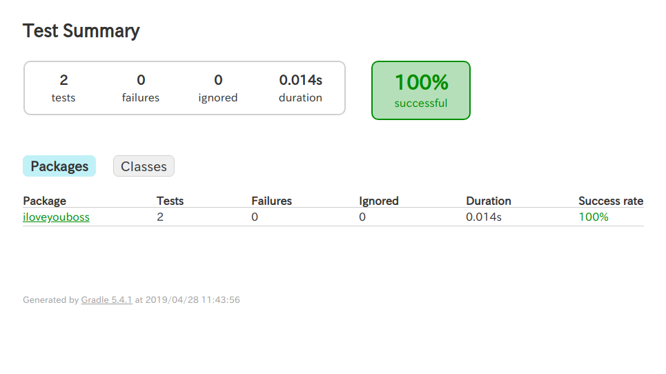

# JUnit 学習用レポジトリ

## はじめに

こちらのブランチは `git clone` 用のブランチです。
以下の書籍を参考にJUnitを学習する想定になっています。

[実践 JUnit ―達人プログラマーのユニットテスト技法](https://www.amazon.co.jp/%E5%AE%9F%E8%B7%B5-JUnit-%E2%80%95%E9%81%94%E4%BA%BA%E3%83%97%E3%83%AD%E3%82%B0%E3%83%A9%E3%83%9E%E3%83%BC%E3%81%AE%E3%83%A6%E3%83%8B%E3%83%83%E3%83%88%E3%83%86%E3%82%B9%E3%83%88%E6%8A%80%E6%B3%95-Jeff-Langr/dp/4873117305)  

## 目次

1. 環境セットアップ
2. ビルドとコンパイル
3. 参考サイト

## 環境セットアップ

### 動作環境

- Ubuntu16,Windows10
- JDK1.8以上1.10以下

### 手順

1. 作業ディレクトリにコマンドライン(Windowsはコマンドプロンプト)で入り、以下のコマンドを実行する。  
`git clone https://github.com/Takabow0705/junit_study.git`  

2. 使用するOSによって以下の手順を実行する。

　　
＊必要に応じて *gradlew,gradlew.bat*　ファイルに実行権限を付与してください。

- OSX Linuxの場合  
以下のコマンドを作業フォルダ内で実行。  
`cd junit_study`  
`./gradlew build`

- Windowsの場合  
以下のコマンドを作業フォルダ内で実行。   
`cd junit_study`  
`gradlew.bat build`

3. コマンド実行時に以下の文字がコマンドラインに表示されれば成功。  

> $ gradlew build
>  
> BUILD SUCCESSFUL in 1s  
> 4 actionable tasks: 4 up-to-dat`

4. JUnitのテスト結果を確認する。

以下のフォルダ内に生成された、`index.html` をブラウザで確認する。

`junit_study/build/reports/tests/test/index.html`  

以下のような画面が表示されれば成功。

## 注意事項

### Windows環境の方　

1. Windows環境の人は作業フォルダの絶対パスにASCII文字以外が含まれているとビルドに失敗するので、作業フォルダの絶対パスにはご注意ください。

## ビルドとコンパイル

今までは `javac` コマンドによって *.java*ファイルをコンパイルしていたが、今回は全て `gradlew` コマンドによってそれが実行されている。  
今後、新規の `.java` ファイルを追加しても、セットアップ手順と同様に`gradlew`コマンドを叩くことで自動的にコンパイルが行われる。

**注意！**  
今回はJUnitを動かすことのみを目的としているため、`gradlew`コマンドによってメインクラスを起動することはできない。

## 参考サイト

[Gradle で JUnit によるユニットテストを実行する](https://maku77.github.io/gradle/test-junit.html) 

[【Java】Gradleのインストールと基本的な使い方（画像付きで解説）](https://eng-entrance.com/gradle-install-use)

[インストールレスで Gradle してみる](http://d.hatena.ne.jp/bluepapa32/20110308/1299602195)
